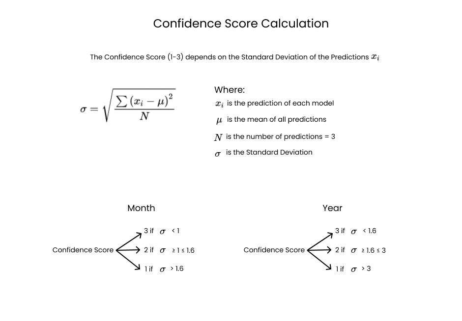

# Consultex
[Website](https://consultex.tech)

This is the official code base for Consultex which includes the Jupyter Notebooks used to train the models, training data, website code along with other files.

## Work Flow of Calculating Returns
We currently use an **ensembling technique** involving three different AI models (each taking different inputs) to forecast returns.
Unlike other repositories / articles / videos trying to do something similar, we forecast **"Returns" instead of "Prices"**.

The following image explanins how we do so.

(Image of the Updated Data Flow)

- ### [Multivariate LSTM](./notebooks/Multivariate_LSTM.ipynb)
- ### [ARIMA (Autoregressive integrated moving average) model](./notebooks/ARIMA_forecasting.ipynb)
- ### [Fb Prophet](./notebooks/FB_Prophet_Forecast.ipynb)

## Calculating Confidence Scores
Confidence scores are calculated by computing the standard deviation of all predictions in the following manner.
The idea is that when predicted returns are **"closer"** / **less spread out**, it indicates that all models have picked up a **common trend** and the final forecast is very likely to be accurate. The **"farther"** / **more spread out** the forecasts, the **less certainty** we have.

The following image explanins how we do so.

## Summary
All calculations are summed up [here](./Forecast_for_the_month_of_November.pdf)
